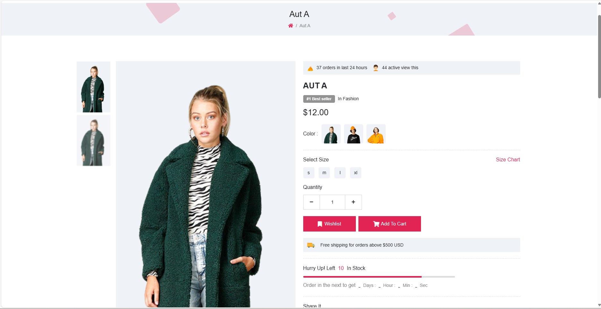
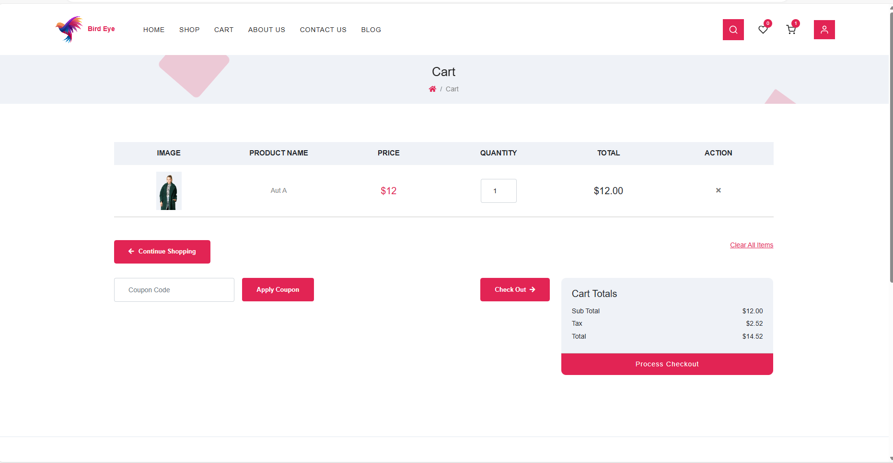

# EcomHub

EcomHub is an E-commerce platform that allows users to browse, purchase, and manage clothing products online. The platform is designed to provide a seamless shopping experience with a user-friendly interface.

## Features

- **User Authentication**: Secure login and registration with email verification.
- **Product Catalog**: Browse a wide range of clothing items with detailed descriptions, prices, and images.
- **Shopping Cart**: Add items to the cart for a quick and easy checkout process.
- **Payment Integration**: Supports multiple payment methods including credit/debit cards, UPI, and wallets.
- **Order Tracking**: Track the status of your orders in real-time.
- **Wishlist**: Save your favorite products for later purchase.
- **Responsive Design**: Optimized for both desktop and mobile devices.

## Installation

1. **Clone the repository**:
   ```bash
   git clone https://github.com/yourusername/ecomhub.git

- cd ecomhub
- composer install
- npm install
- php artisan key:generate
- php artisan migrate
- php artisan serve

## sample




